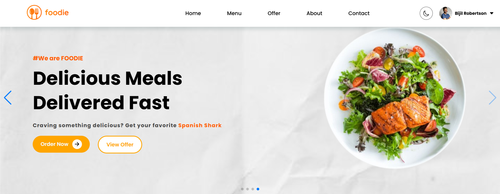
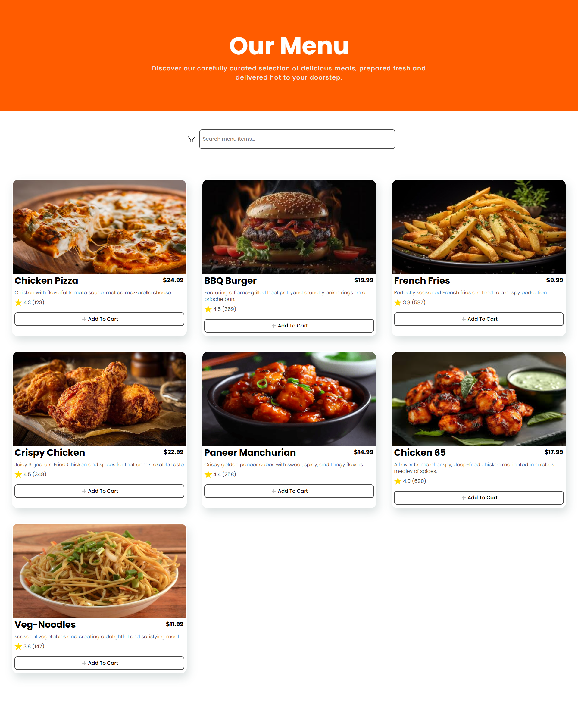
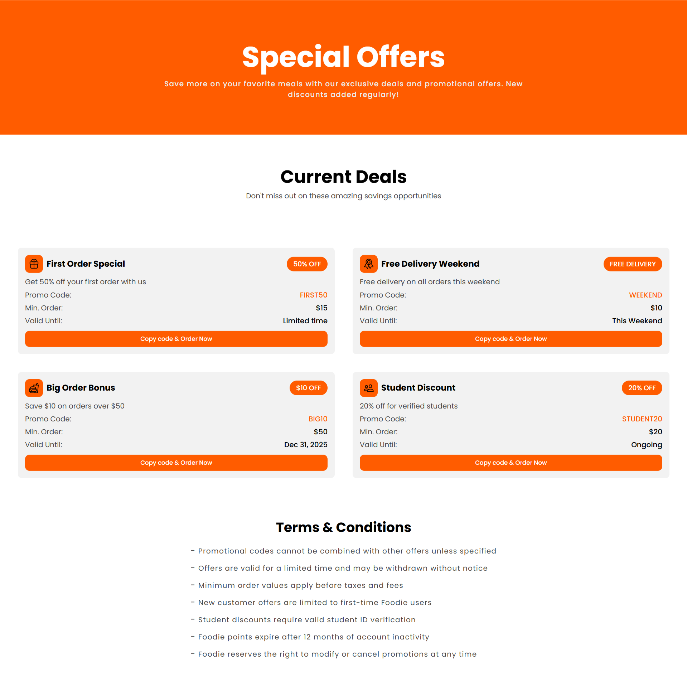
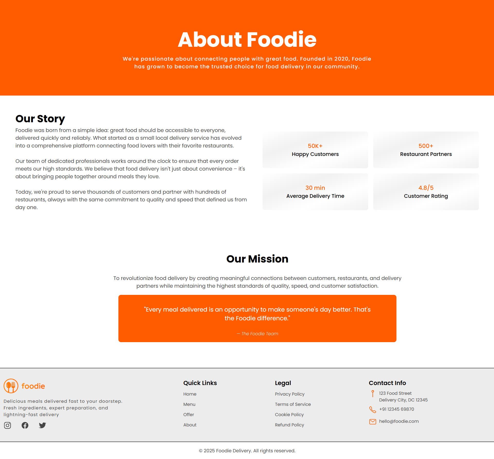

# Foodie — Responsive Restaurant / Food Landing Page

A simple, responsive food / restaurant landing page built using **HTML**, **CSS**, and **JavaScript**.  
Showcases menu sections, scroll animations, and a modern UI/UX experience.

---

## Demo / Screenshot

🌐Live site: [ar-foodie.vercel.app](https://ar-foodie.vercel.app/)  

     

---

## Technologies Used

- HTML5  
- CSS3 (Flexbox/Grid, media queries, transitions/animations)  
- Vanilla JavaScript (scroll events, DOM manipulation)  

---

## Features & Highlights

- Fully responsive across mobile, tablet, desktop  
- Smooth **scroll animations / reveal effects** as user navigates  
- Navigation menu with anchor links to page sections  
- Clean, modern design emphasizing food imagery and layout  
- Deployed via Vercel for accessible live demo  

---

🚀 Getting Started (Local Setup)

1. Clone the repository

   git clone https://github.com/Rahumansgit/Foodie.git

2. Navigate into the project folder

   cd Foodie

3. Open `index.html` in your browser

   * You can double-click it
   * Or run a local server / Live Server extension in VSCode for better results

4. If you make changes, refresh browser to see updates

---

Contributing

Contributions, feedback, and improvements are welcome!

* Feel free to fork the repo, make changes, and open a pull request
* Ideas for enhancements:

  * Add a contact / reservation form
  * Add filtering / category menu
  * Integrate animations / transitions further
  * Improve accessibility, add ARIA, keyboard navigation
  * Add more pages (About, Services, Testimonials)

---

Roadmap / Future Ideas

* Add dynamic menu filtering / categories
* Add “Order Now” or “Cart” simulation
* Add content animations / parallax effects
* Add section transitions, lazy loading images
* Improve SEO, metadata, and performance
* Add dark mode toggle

---

